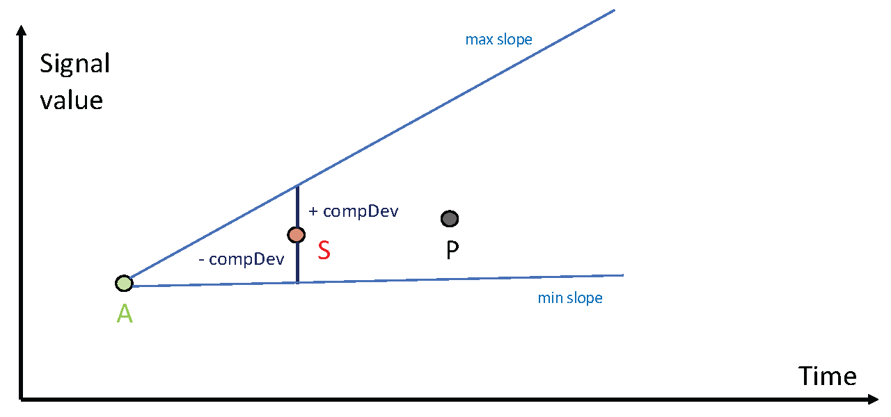
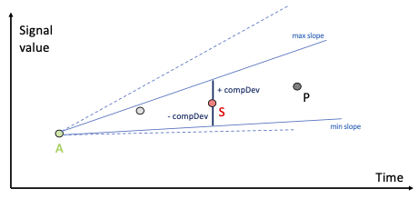
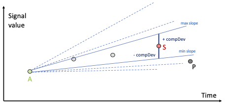
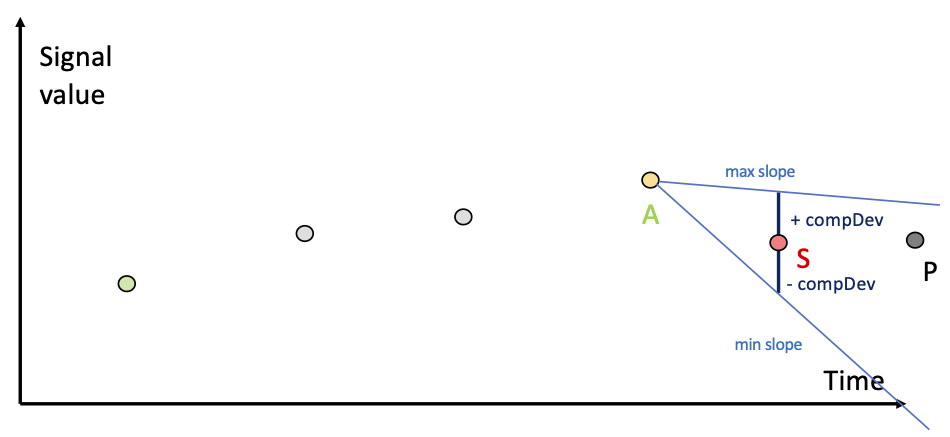
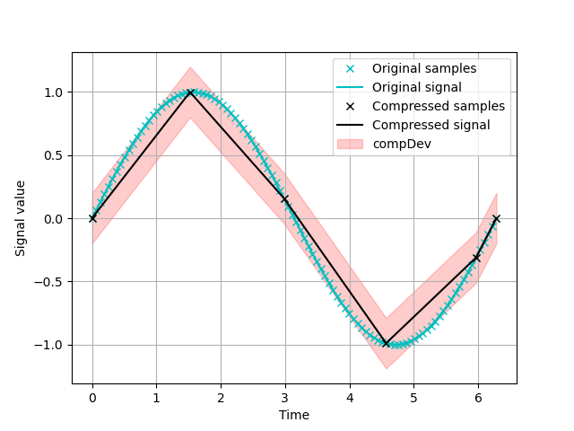
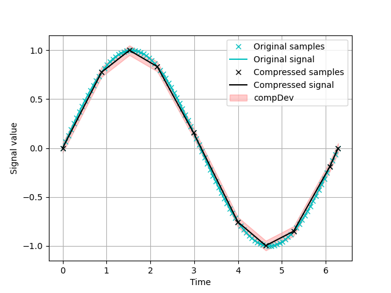
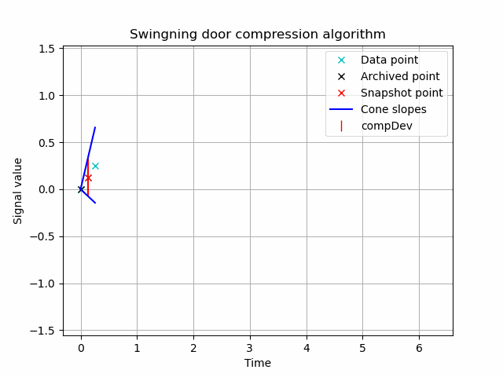
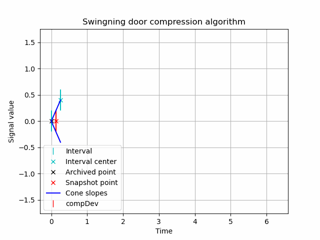

# Swinging door compression algorithm

In this repository I implement the **swinging door** compression algorithm (SDCA). \
The SDCA is used to compress streamed data in form of **univariate** time-series in an **online** manner.

The data compressed by a SDCA allow to reconstruct the original signal as a series of straight lines (linear interpolation). \
The reconstruction **error** is guaranteed to be no more than the **compression deviation** (tuneable).

This algorithm is a fundamental part of compression systems like [**PI**](https://www.youtube.com/watch?v=89hg2mme7S0&ab_channel=OSIsoftLearning).

## Requirements 📚

This repository has been created with Python *version 3.8.8.*

### Libraries

[NumPy](https://numpy.org/) \
[matplotlib](https://matplotlib.org/) \
[celluloid](https://pypi.org/project/celluloid/)


## How does it work? 🤖

### Notation

Suppose that an initial **archived** (`A`) data point is given. Archived data points form the comppressed **representiation** of the streamed signal that we aim to compress. Usually we archive the first point of the streamed signal as a **starting point**.

From the last archived point (`A`) we can define the **state** of the compression process by means of the **snapshot** (`S`), a received data point that plays an inportant role in the compression mechanism.

Finally, the last received data point is denoted by `P`.

### Compression mechanism

> NOTE: The compression mechanism is referred to as **compression test** in this implementation of the SDCA the compression test is divided in two *subtests*, namely the **inspection test** and the **cone test**.

### Inspection test

This implementation of the SDCA allows to **except** (ignore) those points `P` which are separated by less than a **minimum** temporal discance with respect to `A`. \
In the same way, we can define a **maximum** temporal distance for which the points `P` get archived regardless of the compression state (*see cone test*).

Those magnitudes, in the code, are called `compMin` and `compMax` and are set to $0$ and $\infty$ (*by default*) respectively.

### Cone test 

The most recently archived point (`A`), the current snapshot point (`S`) and the compression deviation (`compDev`) define a **cone**: \


1. If the incoming data point (`P`) falls between the **max slope** and **min slope** of the cone, then `P` becomes the new snapshot: \


2. The angle between new slopes **always** need to be narrowing (the algorithm selects the narrower slope between the new and previous slope).

3. When the next point is out of the cone, the algorithm archives the previous received point (the current snapshot) and the incoming point becomes the next snapshot: \
 \


4. Return to first step.

## Insights 🍿

You can find an example of how to compress a "streamed" signal in the file `example.py` 

The **example** generates plots as the following: 

 \


As well as printing (*in console*) the compression **ratio** of the compressed signal with respect to the original one.

>**NOTE 1**: for actual streamed signals you can access the **memory** of the SDCA to have access to the compressed points *on-the-fly*.
```
SDCA = SwingingDoor()
SDCA.archiver.memory()
``` 
>You can create your own memory structure as well as recovering functions by modifying the code.

> **NOTE 2**: the code is commented so I leave to you the rest of the details.

### Animation 🍦

There is an additional python script called `animation.py` for the sake of visualizing the compression test. \
It does not have any role in the main script `compressor.py`.

These are some animations for a sinusoidal time-series compressed before and after quantization (*uniform mid-tread*):

 \

